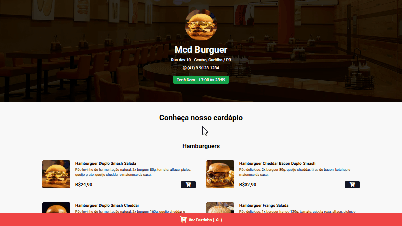
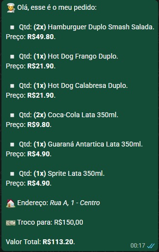
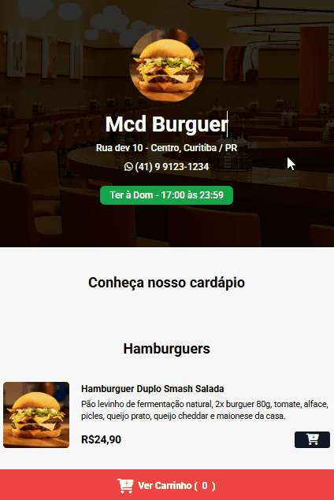

# 🍔 Cardápio Digital - Hamburgueria

Aplicação web de cardápio digital interativo para hamburguerias, permitindo navegar entre os produtos, gerenciar o carrinho e finalizar pedidos via WhatsApp.

## 📸 Preview

<table align="center">
  <tr>
    <td valign="center">
      
    </td>
    <td valign="center">
      
    </td>
    <td valign="center">
      
    </td>
  </tr>
</table>

🔗 **Demo:** https://cardapio-khaki-nine.vercel.app/

⚠️ Nota: O horário de funcionamento foi ajustado para das 04h às 03h apenas para fins de teste, permitindo acesso ao sistema na maior parte do dia.

<br>

<div align="center">


</div>

---

## ✨ Features

- 📋 Listagem dinâmica de produtos  
- 🛒 Carrinho de compras interativo  
- ➕ Adição e remoção de itens  
- 💰 Cálculo automático do total  
- ⏰ Status de funcionamento (aberto/fechado)  
- 📱 Integração com WhatsApp  
- 🎨 Interface responsiva  

---

## 📦 Como rodar o projeto

```bash
git clone https://github.com/mcdcwb/cardapio.git
cd cardapio
```

---

## 🚀 Stacks utilizadas:
<div style="display: inline_block">
    
    
    
    
</div>
